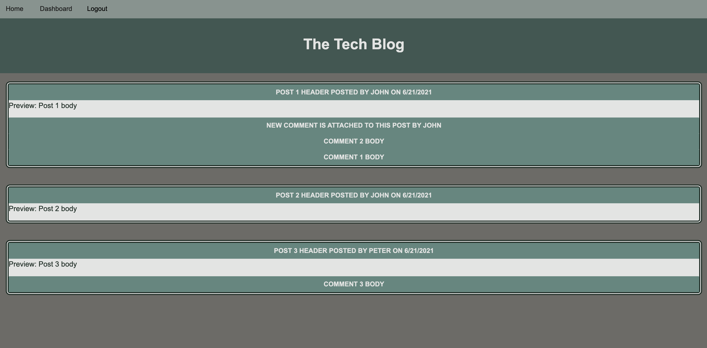
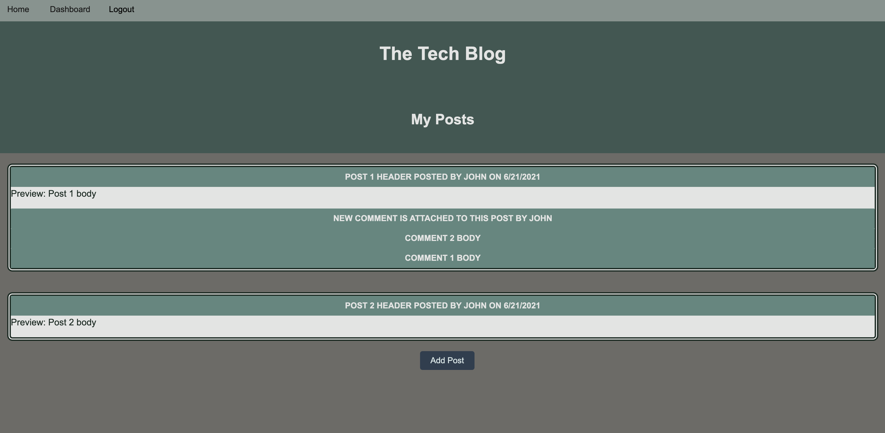
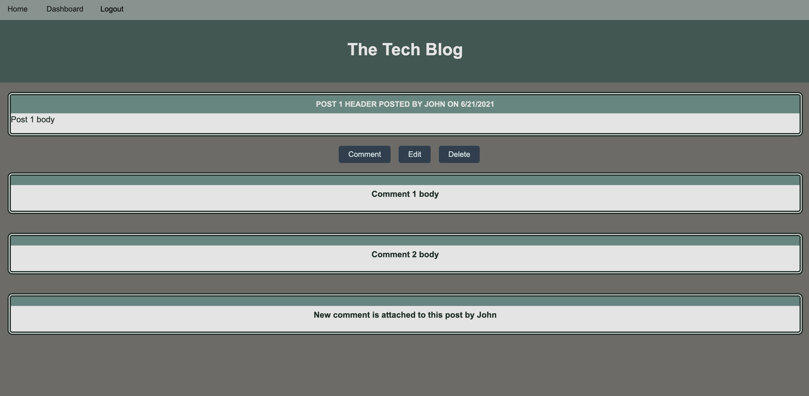

# Model-View-Controller Application: Tech Blog
CMS-style blog site similar to a Wordpress site, where developers can publish their blog posts and comment on other developers’ posts as well.

## Description

The application is built with the model-view-controller concept, using encryption to store login information, MySQL database, Express server, Handlebars as a templating language, Sequelize as the object relational management, and express-session package for session cookies management for authentication. Deployed at Heroku using AWS deployment for MySQL database.

## Table of Contents

  [Title](#title)

  [Description](#description)

  [Installation](#installation)

  [Usage](#usage)

  [License](#license)

  [Contributing](#contributing)

  [Questions](#questions)

## Installation

Application is fully deployed in the cloud so no installation is required - please use the following URL to run it from the browser:

https://cms-blog-vl.herokuapp.com/

## Usage

Please refer to the screenshots below for reference.

The functionality differs slightly depending on whether the user of the application has been authenticated or not.

Also, the app keeps the authorization sessions for some time to remember the user (cookies are stored in the user browser site).

When the home screen is used, all the posts are visible. Each visible post displays a preview of its content (the helpers function of Express Handlebars cuts the body of the post for the preview display). The dates are also custom formated.

When dashboard is used, the posts are created by the authorized user are visible.

The authorized user can comment any post in the system - the system will track that comment to the user who commented. That same user has the ability to update and delete the existing comments too.

Once the post is deleted, all comments of this post will be deleted too.
The post can be edited (updated) if the user is logged in.

Only the logged in / registered users can add the posts.

The system allows to login or signup options.

The user passwords and e-mails stored in the database are encrypted (Bcrypt library is used for the encryption).

Below screenshot demonstrates the system view of the home page - the user sees all the posts

Here, only my posts are displayed (posts belong to the logged in user)

At this screenshot, the post which belongs to the authorized user is displayed - the buttons edit, delete and comment are present

## Credits

Express
mySQL2
Sequelize
DotEnv
Express-handlebars
Connect-session-sequelize

## License

MIT License

Copyright (c) 2023 vasilyl1

Permission is hereby granted, free of charge, to any person obtaining a copy of this software and associated documentation files (the "Software"), to deal in the Software without restriction, including without limitation the rights to use, copy, modify, merge, publish, distribute, sublicense, and/or sell copies of the Software, and to permit persons to whom the Software is furnished to do so, subject to the following conditions:

The above copyright notice and this permission notice shall be included in all copies or substantial portions of the Software.

THE SOFTWARE IS PROVIDED "AS IS", WITHOUT WARRANTY OF ANY KIND, EXPRESS OR IMPLIED, INCLUDING BUT NOT LIMITED TO THE WARRANTIES OF MERCHANTABILITY, FITNESS FOR A PARTICULAR PURPOSE AND NONINFRINGEMENT. IN NO EVENT SHALL THE AUTHORS OR COPYRIGHT HOLDERS BE LIABLE FOR ANY CLAIM, DAMAGES OR OTHER LIABILITY, WHETHER IN AN ACTION OF CONTRACT, TORT OR OTHERWISE, ARISING FROM, OUT OF OR IN CONNECTION WITH THE SOFTWARE OR THE USE OR OTHER DEALINGS IN THE SOFTWARE.

## Contributing

vl1
  
## Questions

My GitHub name is vl1. Most of the answers to the questions can be found there, here is the link to my profile at GitHub:

https://github.com/vl1

For additional questions please e-mail to likhovaido@gmail.com

Thank you for your interest in this app.
